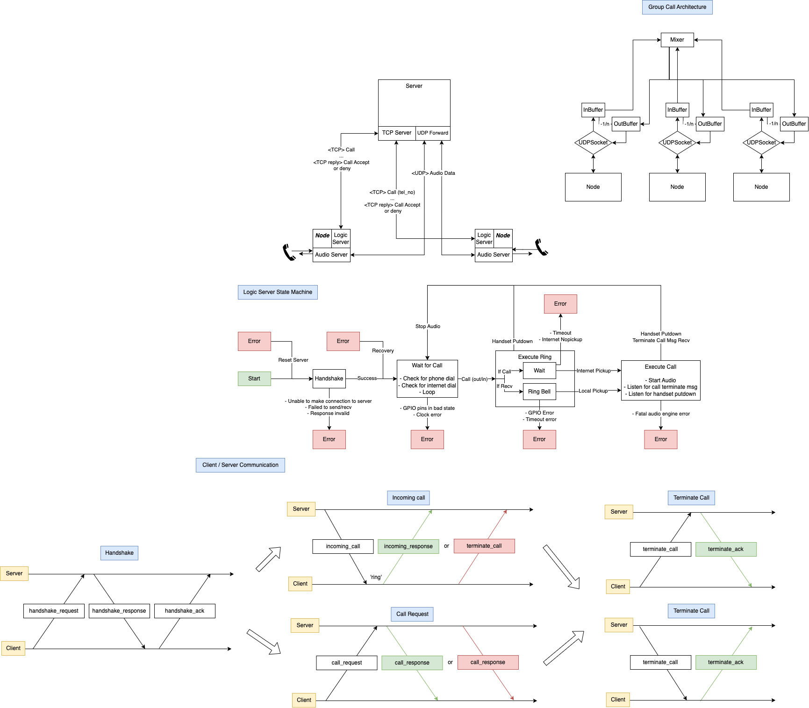
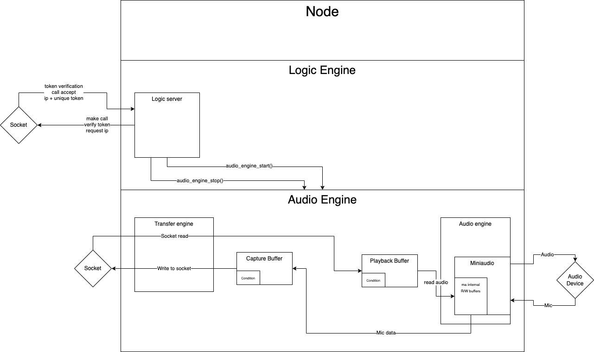

# intercom
Rapsberry Pi based home intercom for rotary telephones.

## Netork Design

The intercom network is designed with several nodes, representing the telephones, and a central server, for authentication and managing communications with all of the telephones.

## Internal Design

The internal design is composed of a main logic server, for handling making calls, verifying details and other abstracted logic, and an audio engine, which handles reading the raw audio data from the network and a microphone, and transmitting that information to the relevant destination.

The main thread runs the logic server, and on initialisation, starts a worker process for the audio engine and another for the transfer engine. Both of these threads will block until the function audio_engine_start() is called, in which case the audio engine will begin functioning and reading data from a specified source.

The audio engine utilises the [miniaudio](https://github.com/mackron/miniaudio/tree/master) library to physically communicate with audio devices.

## Hardware Design

The intercom system is meant to be run on a Raspberry Pi device, interfacing with an old rotary telephone. Since the Raspberry Pi does not have a ADC for converting microphone to digital, an external sound-card must be used. To achieve this, you can use a USB to AUX converter, and then extract the signals with an AUX to breadboard adapter or similar.

You must ensure that both the USB sound-card, and the AUX adapter are both TRRS cables and support mic and sound. Since the rotary telephones have only mono-audio, when connecting the adapter to the breadboard, you can combine the tip and first ring connectors together to achieve this (within miniaudio, the channels are set to 1 so they are mono anyway).

Next is connecting the Raspberry Pi to the rotary dialer. The rotary dialler works by disconnecting a cable n times over the course of it turning, with n representing the number dialled. To interpret this, you will need to :
- First connect a digital input pin to one side of the dialler.
- Connect the other side of the dialler to ground.
- Pull the pin up (handled in code)

The ringer is more complicated since it takes alternating current at around 60 VAC, 25 Hz. (TODO)

## Extended Goals
- Implement complete end-to-end encryption of all data transferred over the network.
- Implement a website hosted on the server that users can use to manage their network of intercoms, i.e. change numbers, block phones, check status, etc.